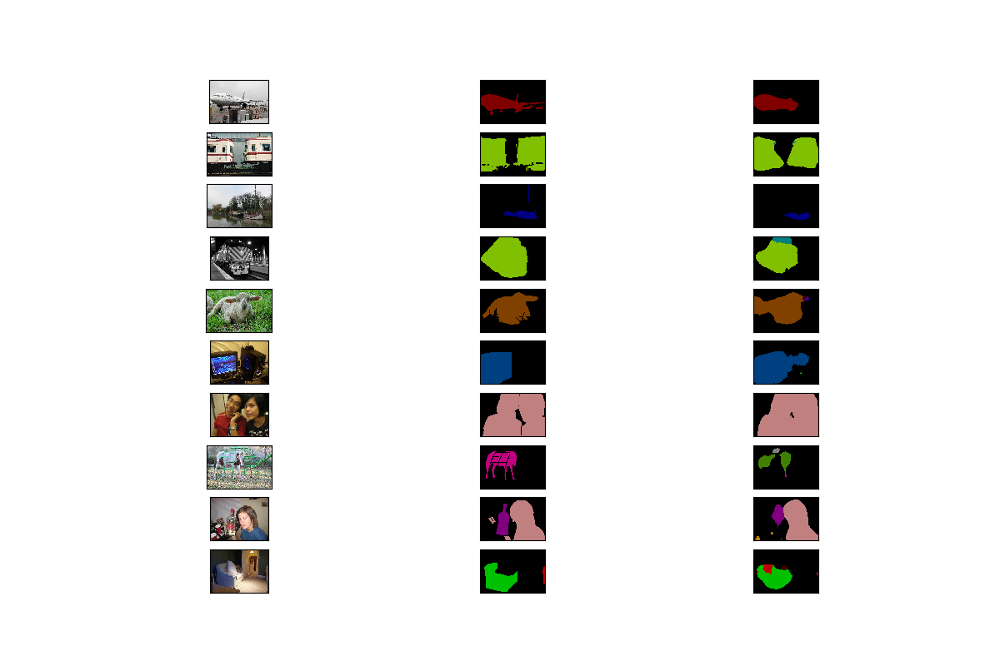
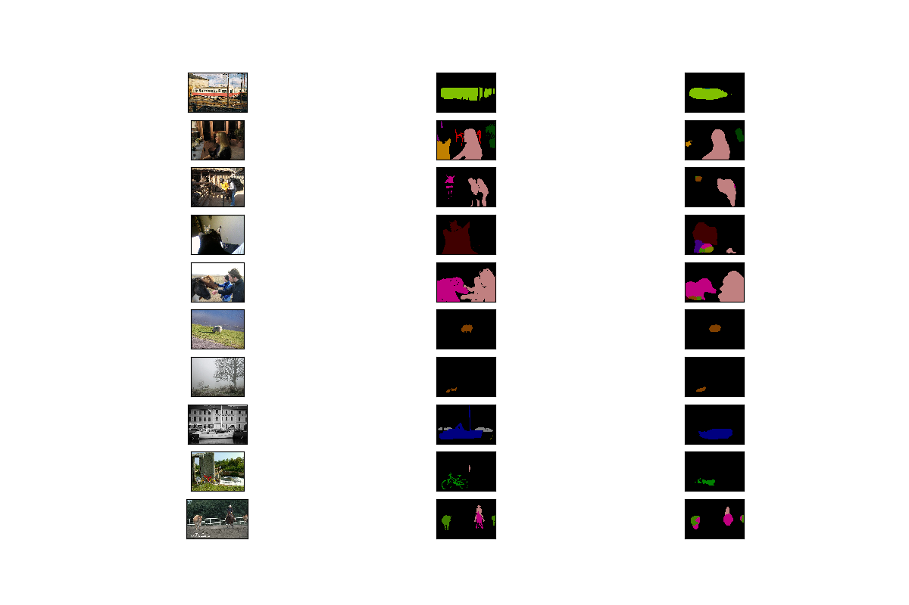

# NaiveFCN

## DataSet
[VOC2012](https://link.zhihu.com/?target=http%3A//host.robots.ox.ac.uk/pascal/VOC/voc2012/VOCtrainval_11-May-2012.tar)

## Environment
[requirements.txt](requirements.txt) will be ok.

## Hyperparameters and Mean IoU
| Epoch | Batch Size | Learning Rate | Weight Decay | Train MIoU | Valid MIoU |
|:-:|:-:|:-:|:-:|:-:|:-:|
| 80 | 32 | 1e-2 -> 1e-3 | 1e-4 | 0.67659 | 0.59403 |

## Prediction Example
Fisrt column for true images, second column for true labels and third column for prediction results.

1. 
2. 

## Log File
[log.txt](./log.txt)
